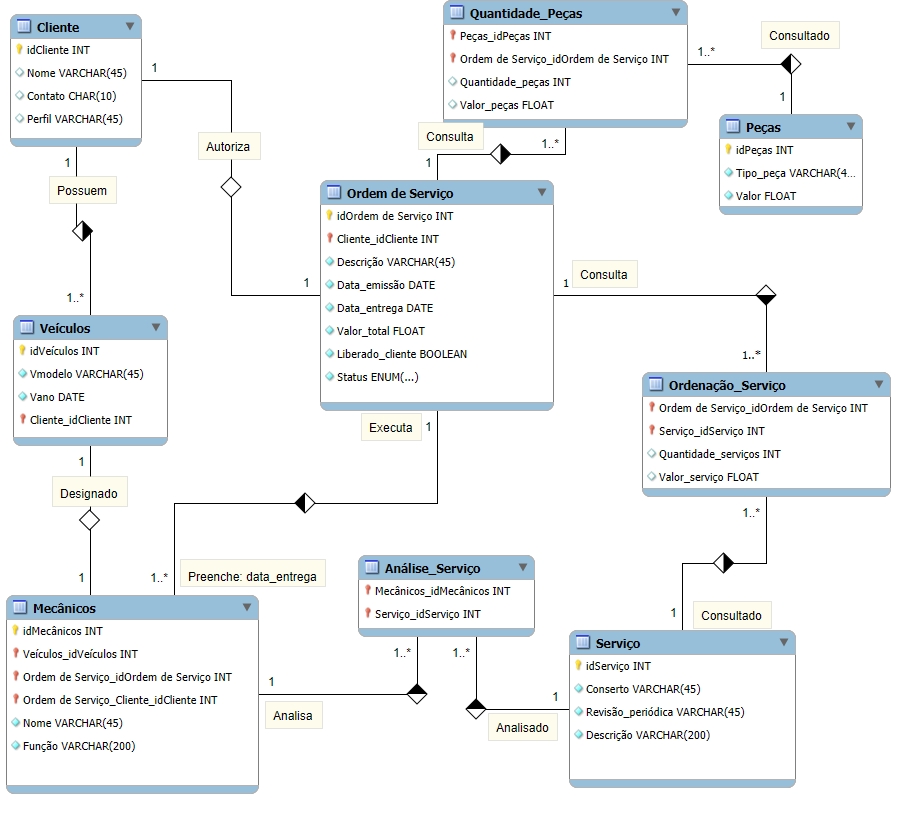
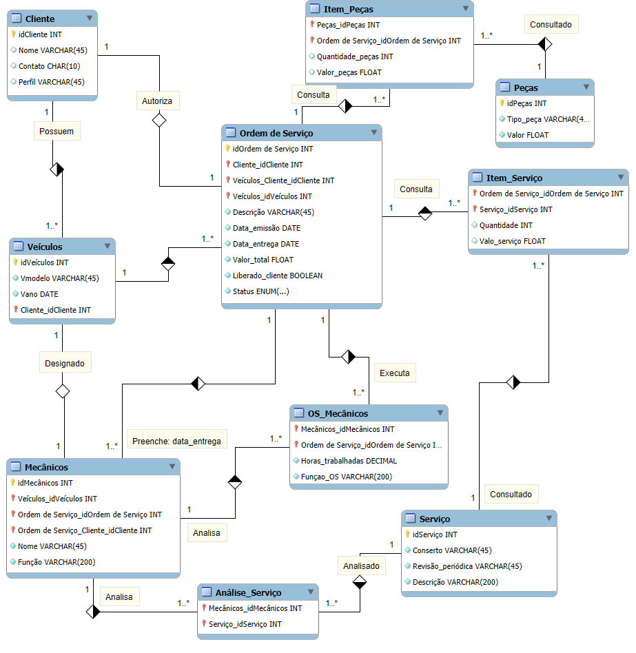

# Projeto Oficina Mecânica
Projeto de modelagem sobre uma Oficina Mecânica, especificamente os passos para uma Ordem e Serviço, aplicando diagrama de classes no MySQL Workbench. Utilizando conhecimentos de DER (Diagrama Entidade-Relacionamento) e o EER (Diagrama Entidade-Relacionamento Estendido).

## Escopo da Modelagem:

Oficina:
- Sistema de controle e gerenciamento de execução de ordens de serviço em um oficina mecânica.
- Clientes levam veículos à oficina mecânica para serem consertados ou para passarem por revisões periódicas.
- Cada veículo é designado a uma equipe de mecânicos que identifica os serviços a serem executados e preenche uma OS (Ordem de Serviço) com data de entrega.
- A partir da OS, calcula-se o valor de cada serviço, consultando-se uma tabela de referência de mão-de-obra.
- O valor de cada peça também irá compor a OS.
- O cliente autoriza a execução dos serviços.
- A mesma equipe avalia e executa os serviços.
- Os mecânicos possuem código, nome, endereço e especialidade.
- Cada OS possui: nº, data de emissão, um valor, status e uma data para conclusão dos trabalhos.
- Uma OS pode ser composta por vários serviços e um mesmo serviço pode estar contido em mais de uma OS.
- Uma OS pode ter vários tipos de peça e uma peça pode estar presente em mais de uma OS.

## Primeira Versão da Modelagem ✅

## Segunda Versão da Modelagem ✅

### Ferramenta utilizada:

Modelado pelo MySQL Workbench na versão 8.0 CE
* [MySQL](https://www.mysql.com/)